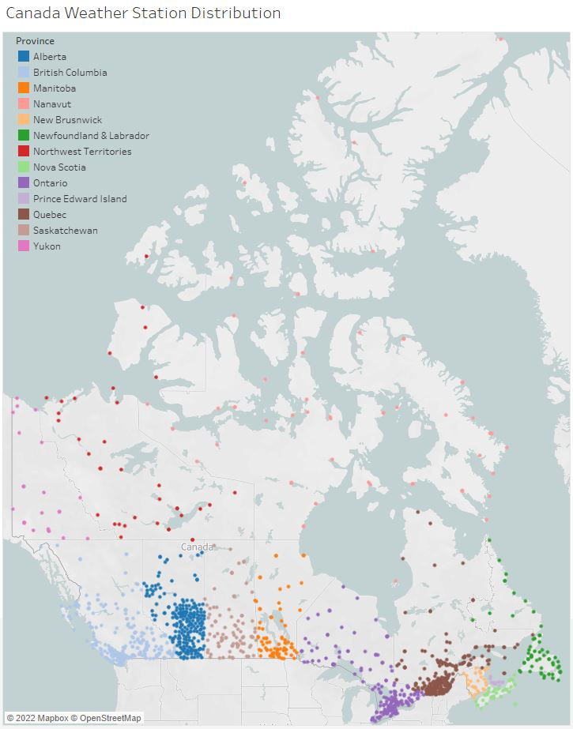

# Assignment_2
Vector Visulaization

Hypothesis: The density of weather station distribiution decreases with an increase in latitude.

Humans are more concered with the weather in their immediate vicinity, and as the population density
of a region decreases, so too will the number of weather stations. 
The vector visualization below displays the location of all weather stations in Canada. 
Notice the decrease in weather station density as the latitude increases. 
This distribution could inadvertently comprimise climate models that are based on the observations 
from these weather stations. 

